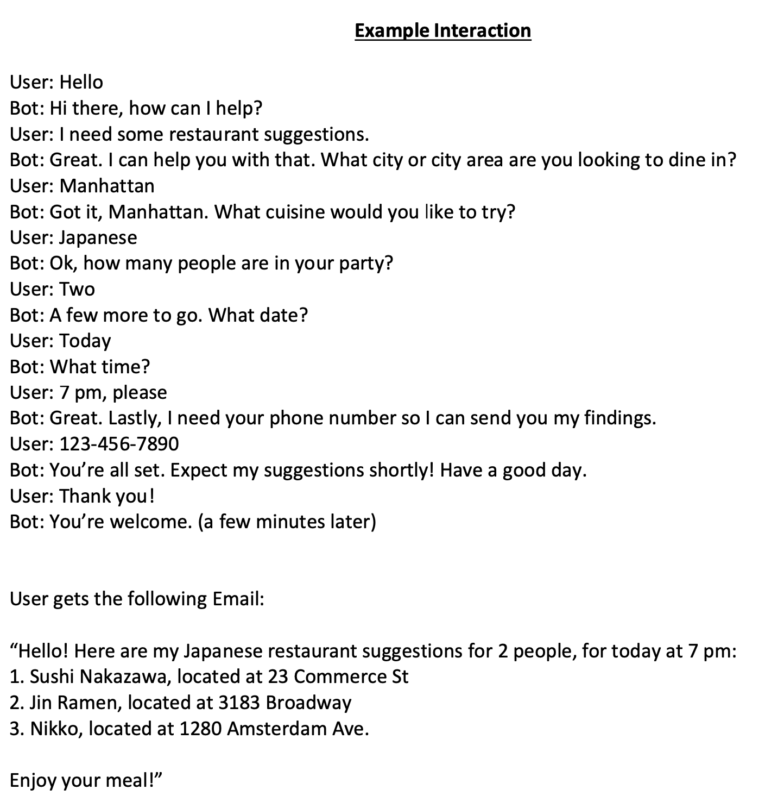
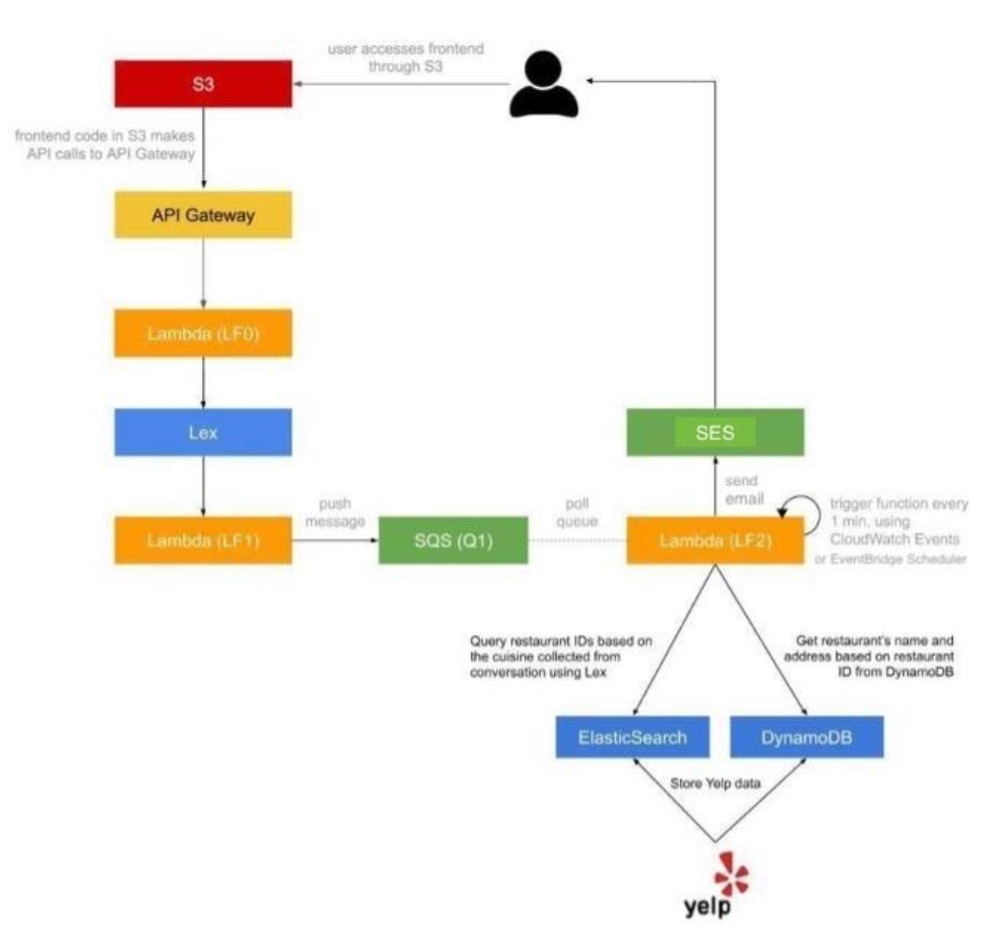

## Introduction

Customer Service is a core service for a lot of businesses around the world and it is getting disrupted
now by Natural Language Processing-powered applications.
In this project we implemented a serverless, microservice driven web application. Specifically,
you built a Dining Concierge chatbot that sends you restaurant suggestions given a set of
preferences that you provide the chatbot with through conversation

## Example Interaction

## Architecture

